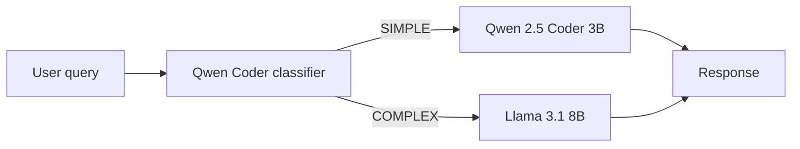

# Smart LLM Router

A local **LLM routing** system: classify each user query, send it to the right model on your GPU, and (planned) escalate when quality is low. Built for a **12GB VRAM** setup using **vLLM** and **AWQ** models.

## What it does

Heavy prompts go to a larger model; light and code-heavy ones stay on a smaller, faster model. Classification runs on the small model so routing stays cheap. The goal is lower average latency than always calling the 8B model, without giving up quality on hard questions.

## Architecture



**Roadmap** (see `project.md`): FastAPI gateway, SQLite/Postgres logging, quality scoring and escalation, benchmarks, dashboard, Docker.

## Models

| Key | Model | Port | Role |
|-----|--------|------|------|
| `qwen-coder` | [Qwen2.5-Coder-3B-Instruct-AWQ](https://huggingface.co/Qwen/Qwen2.5-Coder-3B-Instruct-AWQ) | 8001 | Simple + code tasks, classifier |
| `llama-8b` | [Meta-Llama-3.1-8B-Instruct-AWQ-INT4](https://huggingface.co/hugging-quants/Meta-Llama-3.1-8B-Instruct-AWQ-INT4) | 8002 | Complex reasoning, fallback |

Ports and VRAM fractions are defined in `config.py`.

## Requirements

- NVIDIA GPU with CUDA (tested around **12GB VRAM**)
- **Linux** or **WSL2** (recommended for vLLM)
- Python 3.10+

## Quick start (WSL)

```bash
cd "/mnt/d/Personal Projects/Smart-LLM-Router"   # adjust to your clone path
bash scripts/setup_wsl.sh
source .venv/bin/activate
```

Start both vLLM servers (or use `python scripts/serve_models.py` after tuning `config.py` for your GPU):

```bash
python scripts/serve_models.py
```

Smoke test and benchmarks:

```bash
python scripts/test_models.py
python scripts/benchmark_models.py
```

Classifier:

```bash
python classifier.py "Your question here"
python scripts/eval_classifier.py
```

Evaluation output is written under `results/` (e.g. `classifier_eval.json`).

## Repository layout

| Path | Purpose |
|------|---------|
| `config.py` | Model IDs, ports, vLLM memory settings |
| `classifier.py` | `classify(query)` → category + target model |
| `test_queries.json` | Hand-labeled queries for classifier eval |
| `scripts/serve_models.py` | Launch vLLM processes, logs under `logs/` |
| `scripts/setup_wsl.sh` | venv + pip install |
| `scripts/test_models.py` | Health check against each model |
| `scripts/benchmark_models.py` | Latency / throughput samples |
| `scripts/eval_classifier.py` | Accuracy + latency vs `test_queries.json` |
| `project.md` | Full 7-day build plan |

## License

Model weights are subject to their respective Hugging Face / Meta / Qwen licenses. Add a project license if you open-source this repo.
